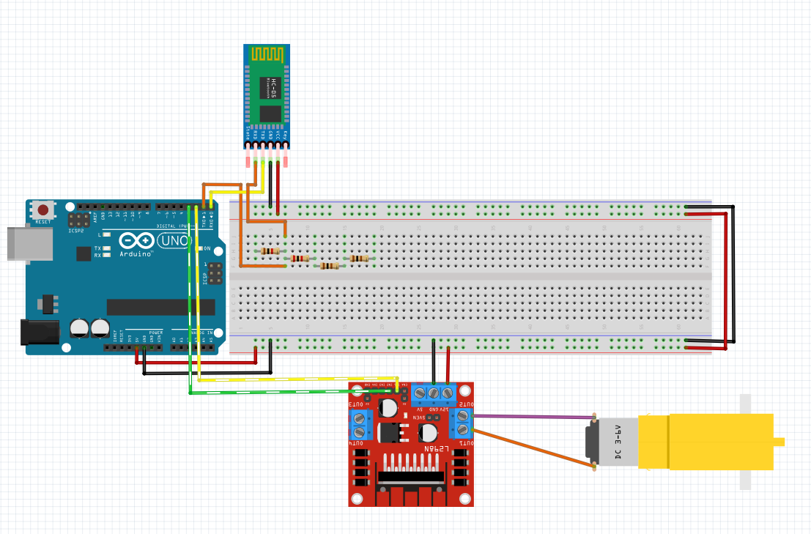

# Alimentador

# Sketch

# Componentes Utilizados
1: 1 Arduino Uno 
2: 1 Protoboard 
3: 1 HC-05 (bluetooth) 
4: 1 Resistor 1kΩ 
5: 1 Resistor 2kΩ 
6: 2 Resistor 100Ω 
7: 1 Ponte H 
8: 1 Motor dc 3v a 6v caixa de redução e eixo duplo  
9: Jumpers 

# Resistores
1: 1kΩ -> Marrom, Preto e Vermelho; 
2: 2kΩ -> Vermelho, Preto e Vermelho; 
3: 100Ω -> Marrom, Preto e Marrom; 
4: 100Ω -> Marrom, Preto e Marrom; 
